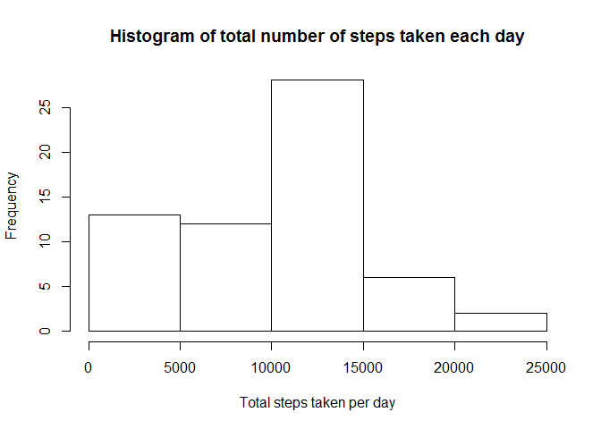
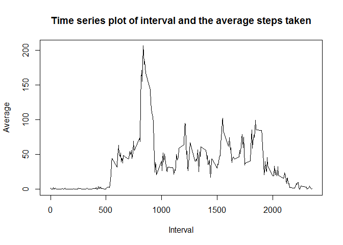
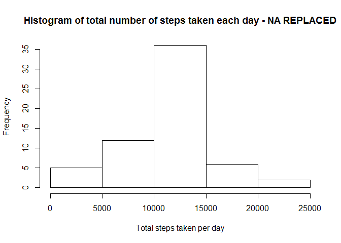

# Reproducible Research: Peer Assessment 1


## Loading and preprocessing the data

This is an R Markdown document for Reproducable Research - Course Project 1. We start by reading the file into R and formatting it.


```r
    activity <- read.csv("C:/Users/Nehash/OneDrive/Data Science Specialization/Reproducable Research/repdata-data-activity/activity.csv")
    activity$date <- as.Date(activity$date, format = "%Y-%m-%d")
```

Next step is to load Dplyr package in R


```r
  library("dplyr", lib.loc="~/R/win-library/3.1")
```

```
## 
## Attaching package: 'dplyr'
## 
## The following objects are masked from 'package:stats':
## 
##     filter, lag
## 
## The following objects are masked from 'package:base':
## 
##     intersect, setdiff, setequal, union
```

## What is mean total number of steps taken per day?


```r
  activity <- group_by(activity, date)
  daily_step_summary <- summarise(activity, sum = sum(steps, na.rm = TRUE))

  hist(daily_step_summary$sum, xlab = "Total steps taken per day", main = paste("Histogram of" ,  "total number of steps taken each day"))
```

 

```r
  mean(daily_step_summary$sum)
```

```
## [1] 9354.23
```

```r
  median(daily_step_summary$sum)
```

```
## [1] 10395
```

## What is the average daily activity pattern?


```r
  activity <- group_by(activity, interval)
  daily_interval_summary <- summarise(activity, avg = mean(steps, na.rm = TRUE))
  
  plot(daily_interval_summary$interval, daily_interval_summary$avg, type = "l", xlab = "Interval", ylab = "Average", main = "Time series plot of interval and the average steps taken")
```

 

## Imputing missing values

```r
  sum(is.na(activity$steps))
```

```
## [1] 2304
```

```r
  activity_copy <- activity
  indx <- which(is.na(activity_copy$steps), arr.ind=TRUE)
  activity_copy$steps[indx] <- mean(activity_copy$steps, na.rm = TRUE)
  
  activity_copy <- group_by(activity_copy, date)
  daily_step_summary_copy <- summarise(activity_copy, sum = sum(steps, na.rm = TRUE))
  hist(daily_step_summary_copy$sum, xlab = "Total steps taken per day", main = paste("Histogram of" ,  "total number of steps taken each day - NA REPLACED"))
```

 

```r
  mean(daily_step_summary_copy$sum)
```

```
## [1] 10766.19
```

```r
  median(daily_step_summary_copy$sum)
```

```
## [1] 10766.19
```
## Are there differences in activity patterns between weekdays and weekends?

```r
  activity_weekday_test <- activity_copy
  activity_weekday_test$date <- as.Date(activity_weekday_test$date)
  weekdays1 <- c('Monday', 'Tuesday', 'Wednesday', 'Thursday', 'Friday')
  activity_weekday_test$wDay <- c('weekend', 'weekday')[(weekdays(activity_weekday_test$date) %in% weekdays1)+1L]
  activity_weekday_test_1 <- activity_weekday_test
  Weekday <- filter(activity_weekday_test_1, wDay == "weekday")
  Weekend<- filter(activity_weekday_test_1, wDay == "weekend")
  group_by(Weekday, interval)
```

```
## Source: local data frame [12,960 x 4]
## Groups: interval
## 
##      steps       date interval    wDay
## 1  37.3826 2012-10-01        0 weekday
## 2  37.3826 2012-10-01        5 weekday
## 3  37.3826 2012-10-01       10 weekday
## 4  37.3826 2012-10-01       15 weekday
## 5  37.3826 2012-10-01       20 weekday
## 6  37.3826 2012-10-01       25 weekday
## 7  37.3826 2012-10-01       30 weekday
## 8  37.3826 2012-10-01       35 weekday
## 9  37.3826 2012-10-01       40 weekday
## 10 37.3826 2012-10-01       45 weekday
## ..     ...        ...      ...     ...
```

```r
  group_by(Weekend, interval)
```

```
## Source: local data frame [4,608 x 4]
## Groups: interval
## 
##    steps       date interval    wDay
## 1      0 2012-10-06        0 weekend
## 2      0 2012-10-06        5 weekend
## 3      0 2012-10-06       10 weekend
## 4      0 2012-10-06       15 weekend
## 5      0 2012-10-06       20 weekend
## 6      0 2012-10-06       25 weekend
## 7      0 2012-10-06       30 weekend
## 8      0 2012-10-06       35 weekend
## 9      0 2012-10-06       40 weekend
## 10     0 2012-10-06       45 weekend
## ..   ...        ...      ...     ...
```

```r
  Weekday_Summary <- summarise(Weekday, avg = mean(steps))
  Weekend_Summary <- summarise(Weekend, avg = mean(steps))
  Weekday_Summary <- mutate(Weekday_Summary, Weekday = "Weekday")
  Weekend_Summary <- mutate(Weekend_Summary, Weekday = "Weekend")
  Summary_Week <- bind_rows(Weekday_Summary,Weekend_Summary)
  
  library(ggplot2)
  Sum_Week <- Summary_Week
 #P <- qplot(interval, avg, data = Sum_Week, facets = Weekday ~., geom = "line", xlab = "Interval", ylab = "Number of steps")
```
